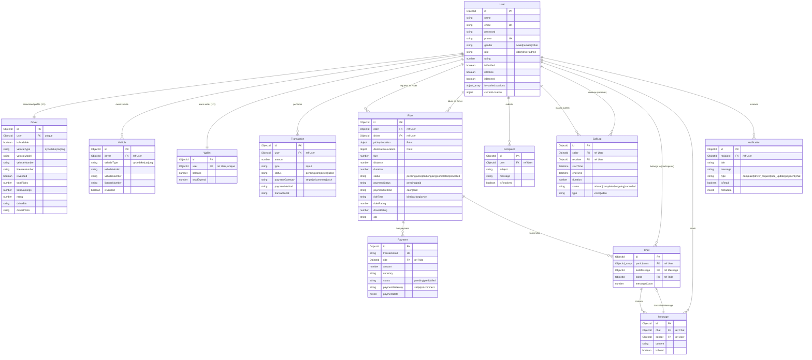

# Rideshare Project Database Design Specification

This document provides a comprehensive overview of the database design for the Rideshare application. The database runs on **MongoDB** and is mapped using **Mongoose ODM**.

---

## 1. Entity-Relationship (ER) Diagram
Below is the visual relationship schema of the database represented in Mermaid.js. 



---

## 2. Detailed Schema Definitions

### 1. User (`auth` Collection)
Stores profile credentials and details of all users (Riders, Drivers, Admins).

| Field | Type | Rules | Description |
| :--- | :--- | :--- | :--- |
| `_id` | `ObjectId` | Primary Key | Auto-generated ID. |
| `name` | `String` | Required | User's full name. |
| `email` | `String` | Required, Unique | User's email address. |
| `password` | `String` | Required, Hidden | Hashed password (selected false). |
| `phone` | `String` | Required, Unique | User's phone number. |
| `gender` | `String` | Enum: `['Male', 'Female', 'Other']` | Gender. |
| `verificationCode`| `String` | Hidden | OTP code for authentication/validation. |
| `verificationCodeExpires` | `Date` | Hidden | Expiry time of the OTP. |
| `role` | `String` | Enum: `['rider', 'driver', 'admin']` | User's access role (default: `rider`). See Section 5 for details on the Admin role. |
| `avatar` | `String` | Optional | URL to the avatar image. |
| `rating` | `Number` | Default: `5` | User rating. |
| `isVerified` | `Boolean` | Default: `false` | Email/Phone verified status. |
| `isOnline` | `Boolean` | Default: `false` | Current socket connection/online status. |
| `isBanned` | `Boolean` | Default: `false` | Admin ban status. |
| `favouriteLocations` | `Array` | Sub-documents: `{name, address, coordinates: [Number]}` | Saved locations. |
| `currentLocation` | `Object` | GeoJSON: `{type: 'Point', coordinates: [Number]}` | Live coordinates (indexed `2dsphere`). |
| `timestamps` | `Boolean` | Auto `createdAt`, `updatedAt` | Auto timestamps. |

---

### 2. Driver (`drivers` Collection)
Extends the `User` model specifically for Drivers, containing licensing and performance data.

| Field | Type | Rules | Description |
| :--- | :--- | :--- | :--- |
| `_id` | `ObjectId` | Primary Key | Auto-generated ID. |
| `user` | `ObjectId` | Required, Unique, Ref: `User` | Reference to the associated User profile. |
| `isAvailable` | `Boolean` | Default: `true` | Driver availability status for ride matching. |
| `vehicleType` | `String` | Enum: `['cycle', 'bike', 'car', 'cng']` | Assigned vehicle category. |
| `vehicleModel` | `String` | Required | Model of the vehicle (e.g., "Toyota Corolla"). |
| `vehicleNumber` | `String` | Optional | Registration number plate. |
| `vehicleImage` | `String` | Optional | URL of vehicle image. |
| `licenseNumber` | `String` | Optional | Driver's license number. |
| `details` | `Mixed` | Default: `{}` | Custom details or metadata. |
| `isVerified` | `Boolean` | Default: `false` | Verification status by the Admin. |
| `totalRides` | `Number` | Default: `0` | Total completed rides. |
| `totalEarnings`| `Number` | Default: `0` | Total earnings made. |
| `rating` | `Number` | Default: `5` | Driver-specific average rating. |
| `driverBio` | `String` | Optional | A short description about the driver. |
| `driverPhoto` | `String` | Optional | Profile photograph of the driver. |

---

### 3. Vehicle (`vehicles` Collection)
Lists vehicles registered in the application.

| Field | Type | Rules | Description |
| :--- | :--- | :--- | :--- |
| `driver` | `ObjectId` | Required, Ref: `User` | Reference to the Driver owning the vehicle. |
| `vehicleType` | `String` | Enum: `['cycle', 'bike', 'car', 'cng']` | Vehicle class. |
| `vehicleModel` | `String` | Required | Vehicle make and model. |
| `vehicleNumber` | `String` | Optional | Number plate details. |
| `vehicleImage` | `String` | Required | URL to vehicle photo. |
| `licenseNumber` | `String` | Optional | Vehicle license details. |
| `details` | `Mixed` | Default: `{}` | Custom properties. |
| `isVerified` | `Boolean` | Default: `true` | Admin verified vehicle. |

---

### 4. Ride (`rides` Collection)
Core transaction table tracking trip requests, pickups, routes, fare, and ratings.

| Field | Type | Rules | Description |
| :--- | :--- | :--- | :--- |
| `rider` | `ObjectId` | Required, Ref: `User` | The rider who requested the ride. |
| `driver` | `ObjectId` | Optional, Ref: `User` | The driver who accepted/completed the ride. |
| `pickupLocation` | `Object` | GeoJSON `{type: 'Point', coordinates: [Number], address: String}` | Pickup location data. |
| `destinationLocation` | `Object` | GeoJSON `{type: 'Point', coordinates: [Number], address: String}` | Destination location data. |
| `fare` | `Number` | Required | Trip fare cost in BDT. |
| `distance` | `Number` | Required | Distance in kilometers. |
| `duration` | `Number` | Required | Estimated duration in minutes. |
| `status` | `String` | Enum: `['pending', 'accepted', 'ongoing', 'completed', 'cancelled']` | Current state of the ride. |
| `paymentStatus` | `String` | Enum: `['pending', 'paid']` | Settlement status. |
| `paymentMethod` | `String` | Enum: `['cash', 'card']` | Payment method chosen. |
| `rideType` | `String` | Enum: `['bike', 'car', 'cng', 'cycle']` | Requested service category. |
| `riderRating` | `Number` | Optional | Rating given by the driver to the rider. |
| `driverRating` | `Number` | Optional | Rating given by the rider to the driver. |
| `otp` | `String` | Optional | Ride verification OTP. |

---

### 5. Payment (`payments` Collection)
Tracks transaction records generated from completed rides.

| Field | Type | Rules | Description |
| :--- | :--- | :--- | :--- |
| `transactionId` | `String` | Required, Unique | Unique transaction code from gateway. |
| `ride` | `ObjectId` | Required, Ref: `Ride` | Associated Ride ID. |
| `amount` | `Number` | Required | Money amount. |
| `currency` | `String` | Default: `BDT` | Currency code. |
| `status` | `String` | Enum: `['pending', 'paid', 'failed']` | Settlement state. |
| `paymentGateway` | `String` | Enum: `['stripe', 'sslcommerz']` | Merchant processor used. |
| `paymentData` | `Mixed` | Optional | Full callback logs from payment gateway API. |

---

### 6. Wallet & Transaction (`wallets` & `transactions` Collections)
Manages rider/driver credits and transfer histories.

#### Wallet Schema
| Field | Type | Rules | Description |
| :--- | :--- | :--- | :--- |
| `user` | `ObjectId` | Required, Unique, Ref: `User` | Associated User profile. |
| `balance` | `Number` | Default: `0` | Current wallet funds. |
| `totalExpend` | `Number` | Default: `0` | Cumulative historical spending. |

#### Transaction Schema
| Field | Type | Rules | Description |
| :--- | :--- | :--- | :--- |
| `user` | `ObjectId` | Required, Ref: `User` | User triggering the ledger entry. |
| `amount` | `Number` | Required | Delta amount. |
| `type` | `String` | Enum: `['in', 'out']` | Deposit (`in`) or Withdraw/Pay (`out`). |
| `status` | `String` | Enum: `['pending', 'completed', 'failed']` | Status of the ledger ledger transaction. |
| `paymentGateway` | `String` | Enum: `['stripe', 'sslcommerz', 'cash']` | Selected gateway. |
| `paymentMethod` | `String` | Optional | Payment card brand or details. |
| `transactionId` | `String` | Optional | External reference key. |

---

### 7. Chat & Message (`chats` & `messages` Collections)
Supports in-app instant messaging between riders and drivers during active rides.

#### Chat Schema
| Field | Type | Rules | Description |
| :--- | :--- | :--- | :--- |
| `participants` | `Array` | Array of `Ref: User` | Array of participating Users (usually Rider + Driver). |
| `lastMessage` | `ObjectId` | Ref: `Message` | Pointer to the latest message for preview. |
| `rideId` | `ObjectId` | Ref: `Ride` | Active trip context. |
| `messageCount` | `Number` | Default: `0` | Message counter. |

#### Message Schema
| Field | Type | Rules | Description |
| :--- | :--- | :--- | :--- |
| `chat` | `ObjectId` | Required, Ref: `Chat` | Reference to the Chat conversation. |
| `sender` | `ObjectId` | Required, Ref: `User` | Sender User profile ID. |
| `content` | `String` | Required | Text payload. |
| `isRead` | `Boolean` | Default: `false` | Delivery read receipt. |

---

### 8. CallLog, Complaint & Notification

#### CallLog Schema (Voice & Video logs)
- `caller`: Ref: `User` (Required)
- `receiver`: Ref: `User` (Required)
- `startTime`: Date (Default: `Date.now`)
- `endTime`: Date (Optional)
- `duration`: Number (Seconds)
- `status`: Enum: `['missed', 'completed', 'ongoing', 'cancelled']`
- `type`: Enum: `['voice', 'video']`

#### Complaint Schema
- `user`: Ref: `User` (Required)
- `subject`: String (Required)
- `message`: String (Required)
- `isResolved`: Boolean (Default: `false`)

#### Notification Schema
- `recipient`: Ref: `User` (Optional)
- `title`: String (Required)
- `message`: String (Required)
- `type`: Enum: `['complaint', 'driver_request', 'ride_update', 'payment', 'chat']`
- `isRead`: Boolean (Default: `false`)
- `metadata`: Mixed JSON payload for deep-linking.

---

## 3. Visual Interactive Diagram Tool (DBML Code)

To construct an interactive, draggable Entity-Relationship Diagram (ERD) with color formatting, follow the instructions below using the provided **DBML (Database Markup Language)** code.

### How to use this:
1. Copy the code block below.
2. Go to **[dbdiagram.io](https://dbdiagram.io)**.
3. Paste the code into the editor on the left side.
4. You will instantly get a visual schema where you can drag tables, zoom in/out, and export the diagram as a **PDF**, **PNG**, or **SVG** image.

```dbml
// Database Markup Language (DBML) Specification for Rideshare App

Table User {
  _id objectid [pk]
  name string [note: "Required"]
  email string [unique, note: "Required"]
  password string [note: "Hidden"]
  phone string [unique, note: "Required"]
  gender string [note: "Male | Female | Other"]
  role string [note: "rider | driver | admin"]
  avatar string
  rating number [default: 5]
  isVerified boolean [default: false]
  isOnline boolean [default: false]
  isBanned boolean [default: false]
  createdAt datetime
  updatedAt datetime
}

Table Driver {
  _id objectid [pk]
  user objectid [unique, ref: > User._id, note: "Required, 1-to-1 link to User"]
  isAvailable boolean [default: true]
  vehicleType string [note: "cycle | bike | car | cng"]
  vehicleModel string [note: "Required"]
  vehicleNumber string
  vehicleImage string
  licenseNumber string
  details object
  isVerified boolean [default: false]
  totalRides number [default: 0]
  totalEarnings number [default: 0]
  rating number [default: 5]
  driverBio string
  driverPhoto string
  createdAt datetime
  updatedAt datetime
}

Table Vehicle {
  _id objectid [pk]
  driver objectid [ref: > User._id, note: "Required"]
  vehicleType string [note: "cycle | bike | car | cng"]
  vehicleModel string [note: "Required"]
  vehicleNumber string
  vehicleImage string [note: "Required"]
  licenseNumber string
  details object
  isVerified boolean [default: true]
  createdAt datetime
  updatedAt datetime
}

Table Ride {
  _id objectid [pk]
  rider objectid [ref: > User._id, note: "Required"]
  driver objectid [ref: > User._id, note: "Optional"]
  pickupAddress string [note: "pickup address string"]
  destinationAddress string [note: "destination address string"]
  fare number [note: "Required"]
  distance number [note: "Required, km"]
  duration number [note: "Required, minutes"]
  status string [note: "pending | accepted | ongoing | completed | cancelled"]
  paymentStatus string [note: "pending | paid"]
  paymentMethod string [note: "cash | card"]
  rideType string [note: "bike | car | cng | cycle"]
  riderRating number
  driverRating number
  otp string
  createdAt datetime
  updatedAt datetime
}

Table Payment {
  _id objectid [pk]
  transactionId string [unique, note: "Required"]
  ride objectid [ref: > Ride._id, note: "Required"]
  amount number [note: "Required"]
  currency string [default: "BDT"]
  status string [note: "pending | paid | failed"]
  paymentGateway string [note: "stripe | sslcommerz"]
  paymentData object
  createdAt datetime
  updatedAt datetime
}

Table Wallet {
  _id objectid [pk]
  user objectid [unique, ref: > User._id, note: "Required"]
  balance number [default: 0]
  totalExpend number [default: 0]
  createdAt datetime
  updatedAt datetime
}

Table Transaction {
  _id objectid [pk]
  user objectid [ref: > User._id, note: "Required"]
  amount number [note: "Required"]
  type string [note: "in | out"]
  status string [note: "pending | completed | failed"]
  paymentGateway string [note: "stripe | sslcommerz | cash"]
  paymentMethod string
  transactionId string
  createdAt datetime
  updatedAt datetime
}

Table Chat {
  _id objectid [pk]
  lastMessage objectid [ref: > Message._id]
  rideId objectid [ref: > Ride._id]
  messageCount number [default: 0]
  createdAt datetime
  updatedAt datetime
}

// Junction table for chat participants (many-to-many helper)
Table ChatParticipant {
  chatId objectid [ref: > Chat._id]
  userId objectid [ref: > User._id]
}

Table Message {
  _id objectid [pk]
  chat objectid [ref: > Chat._id, note: "Required"]
  sender objectid [ref: > User._id, note: "Required"]
  content string [note: "Required"]
  isRead boolean [default: false]
  createdAt datetime
  updatedAt datetime
}

Table Complaint {
  _id objectid [pk]
  user objectid [ref: > User._id, note: "Required"]
  subject string [note: "Required"]
  message string [note: "Required"]
  isResolved boolean [default: false]
  createdAt datetime
  updatedAt datetime
}

Table CallLog {
  _id objectid [pk]
  caller objectid [ref: > User._id, note: "Required"]
  receiver objectid [ref: > User._id, note: "Required"]
  startTime datetime
  endTime datetime
  duration number
  status string [note: "missed | completed | ongoing | cancelled"]
  type string [note: "voice | video"]
  createdAt datetime
  updatedAt datetime
}

Table Notification {
  _id objectid [pk]
  recipient objectid [ref: > User._id]
  title string [note: "Required"]
  message string [note: "Required"]
  type string [note: "complaint | driver_request | ride_update | payment | chat"]
  isRead boolean [default: false]
  metadata object
  createdAt datetime
  updatedAt datetime
}
```

---

## 4. Other Options to View / Export Diagrams

### Option A: Using VS Code Extensions
If you are coding in VS Code, you can view this database diagram directly in your editor:
1. Install the extension **Markdown Preview Mermaid Support** or **Mermaid Previewer**.
2. Open this markdown file, right-click, and click **Open Preview**. The Mermaid code section at the top of the file will automatically render into a beautiful, visual graphical flowchart showing all boxes, data properties, and connections.

### Option B: Mermaid Live Editor
1. Go to [mermaid.live](https://mermaid.live).
2. Paste the Mermaid code from Section 1 into the "Code" panel.
3. Use the download buttons to save the diagram as a **PNG**, **SVG**, or even **PDF**.

---

## 5. Administrative Configuration & Capabilities

### 1. Seed / Auto-Initialization Admin Account
The backend automatically verifies and seeds an Admin user profile upon authentication if it doesn't already exist in the database.

* **Hard-coded Admin Credentials:**
  * **Email:** `rmkayesur@gmail.com`
  * **Password:** `rmkayesur`
* **Auto-seeded Schema Properties:**
  * `name`: `'Admin'`
  * `phone`: `'00000000000'`
  * `role`: `'admin'`
  * `isVerified`: `true`

### 2. Admin Privileges & Database Fields
Users with `role: 'admin'` have system-wide read/write permissions mapped to specific fields:
* **User Management (`auth` collection):**
  * Controls the `isBanned` boolean field on User accounts (Riders and Drivers).
  * Can retrieve all users (`GET /api/v1/users`) or delete specific profiles (`DELETE /api/v1/users/:id`).
* **Driver Verification (`drivers` collection):**
  * Controls the `isVerified` boolean field on the Driver schema to enable or disable drivers for trip matching.
* **Complaint Resolution (`complaints` collection):**
  * Updates the `isResolved` boolean field to `true` when addressing customer disputes.
* **Notification System:**
  * Listens to the Socket.io room named `'admin'` to receive real-time admin-notification payloads.

